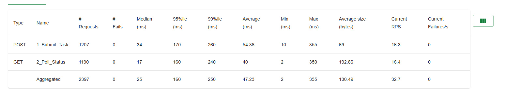
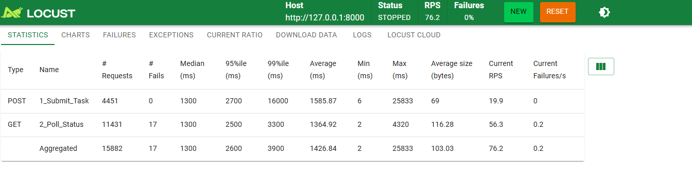
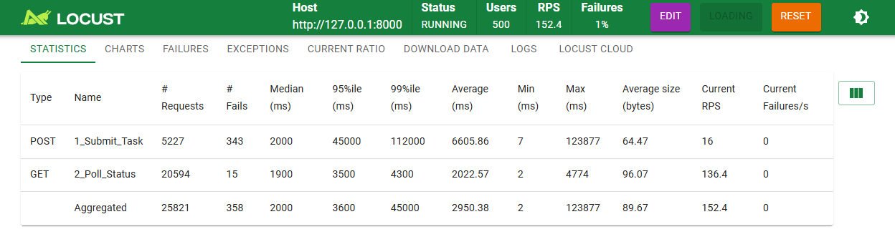

# VisionGuard - 图像质量自动评测平台

VisionGuard 是一款自动化图像质量评估平台。了解决手动评测图像效率低、数据统计易出错的问题，开发了支持自动化执行、多维度指标量化的评测工具。

## 文件说明

| File | Description |
|------|-------------|
| `main.py` | 项目的主程序接口 |
| `run.py` | 自动化批量执行脚本，可以一键处理整个文件夹的图片 |
| `locustfile.py` | 用于进行压力测试，验证系统在高并发下的稳定性 |
| `models/` | 预训练的图像质量评估模型文件 |
| `requirements.txt` | Python 环境依赖文件 |

## 安装依赖

安装所需的依赖：

```bash
pip install -r requirements.txt
```

## 快速开始

### 1. 启动主程序

确保 Redis 在后台运行，然后启动主程序：

```bash
python main.py
```

### 2. 运行批量评估

将要评估的图片放入 `preds/` 文件夹，然后运行：

```bash
python run.py
```

### 3. 访问 Web界面

服务启动后，打开浏览器并访问 `http://127.0.0.1:8000`，即可使用内置的 Web 界面。

## 测试结果

### 50 个虚拟用户测试



### 200 个虚拟用户测试



### 500 个虚拟用户测试



## 部署到云原生

使用 Docker Compose 部署：

```bash
docker compose up --build -d
```
